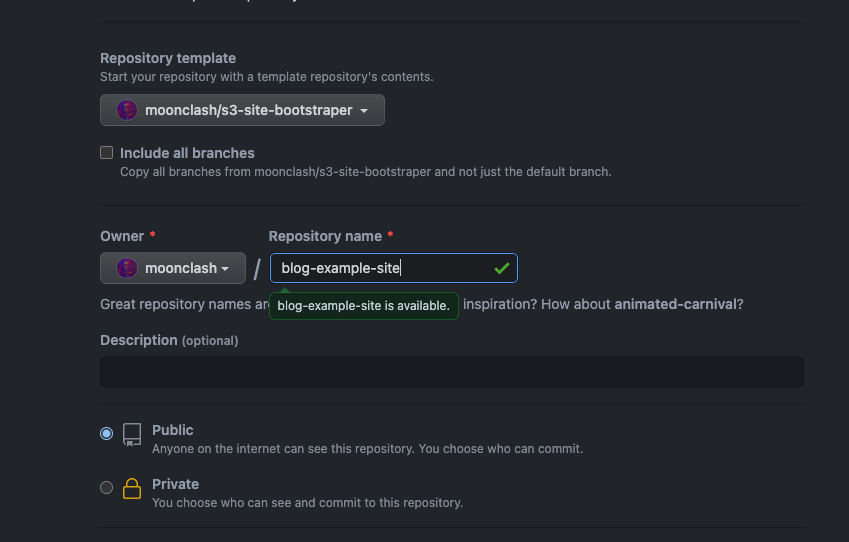
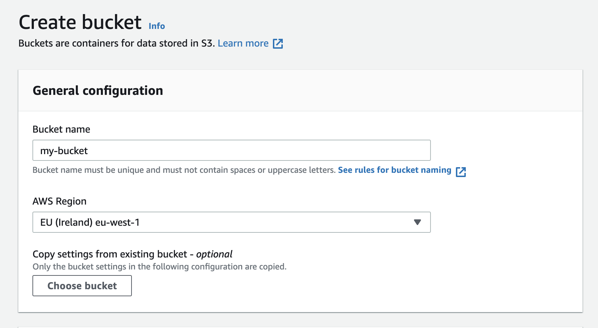
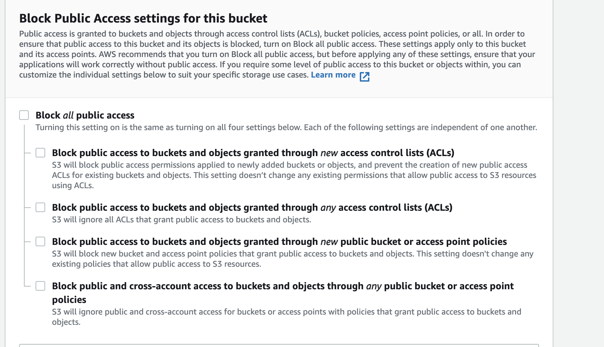
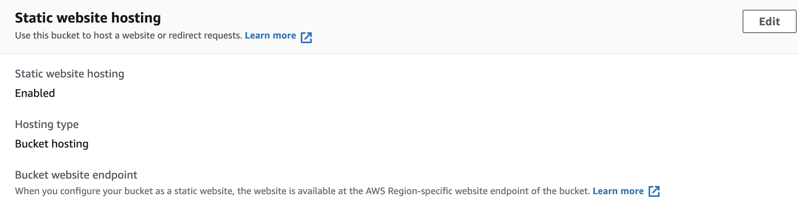
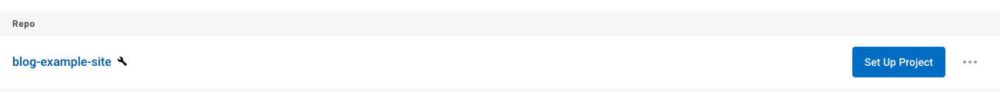
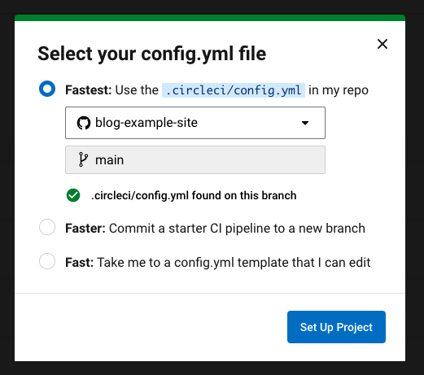

Hey hey, it's been a while once again! So recently I was sitting around thinking: "What is the easiest way I can build an easily customisable static website?". 

### The motivation and research

Now, ths main motivation came from my BJJ gym (yep, I started going to Brazillian Jiu Jitsu and I'm really loving it). What do a BJJ gym and me pondering about static website creationg have in common? Well I thought I'd be cool to build a website for my gym. And since I'm a super nice guy I thought that I don't want to charge them money for it, but it'd be a nice way to show appreciation to all of the teaching, plus I might score some brownie points. Anyway, I started thinking about building something for them that won't cost me or them any money. Now, I've covered the topic before on building static sites with Gatsby or Vue and hosting them on Netlify (hello, this blog is a static website hosted on Netlify), but I wanted ot see if there's a different way to do it. I am not a fan of drag and drop site builders like Squarespace, Wix, etc, I like writing my own code, so those were out the window. And then it hit me! AWS' S3!

So S3 stands for Simple Storage Service and the easiest way to explain is AWS's Dropbox (remember when Dropbox was the absolute GOAT?). You can have folders (AWS call them buckets because why the fuck not), and you can put anything you want in these buckets. But here's one really cool thing about S3's buckets - __they can be used to host static websites__.

### S3 Static Website Hosting

Yep, that's right! You can turn any bucket on AWS into a static website and you'll get an endpoint for it. All you need to do is go to the settings and enable static website hosting, but we'll cover that later when I actually drop the start of this blog post.

So I thought okay, cool! I can write my HTML, CSS and JS and then I can go to the AWS UI and upload my files in the bucket and boom - I have a website.

The moment I imagined this flow I saw some issues.

### The issues with non-automated "deployments" to S3.

I don't even know why I said "deployments". The default flow has nothing to do with deployments. Let's see how it would look like.

1. I go to AWS and create my static website bucket
2. Go back to my IDE, write some HTML 
3. Ugh, okay so I either have to write vanilla CSS or write SASS and then transpite it to CSS
4. Damn it, the same thing for JS, I have to transpile my cool ES6+ code to vanilla JS.
5. Okay I've transpiled everything, now I need to go back to the AWS UI and re-upload my transpiled files
6. Nice, my changes are now reflected.


Okay, I'm being a bit dramatic here, this flow is not the worst flow in the world. But as programmers we want to automate everything and build pipelines and save the world, so I thought, what if I can cut this flow down to less steps? Can I make it look like this:

1. I go to AWS and create my static website bucket.
2. I go to a CI/CD tool and set up a project
3. I write some code and everytime I push my changes to GitHub, my code gets automatically transpiled, minified and uploaded to S3.

Half the steps, double the fun! I don't want people to worry about transpiling code, I don't want them to go to AWS's UI (I don't even want my worst enemy to deal with AWS' UI). I just want them to write write code and ship. 

### Enter the s3-site-bootstrapper

So I created a template repository on GitHub, which I believe has the setup to develop, ship and maintain a static s3 website perfectly.

You can find it [here](https://github.com/moonclash/s3-site-bootstraper)

What does the bootstrapper have that I am so excited about?

Well let's try and make a website with it and see!


First, as this is a template repository, we need to create a project out of it. 



Now that we got that out of the way, let's go to AWS (make an account if you don't have one) and head over to the s3 section.

Let's create a bucket first:



We can name it however we want.

Next off, before we actually create the bucket, to be able to actually publicly hit our endpoint, we need to give it public access like so:



Now that we've created our bucket, we can go to it's properties and enable static hosting like so:



Cool, now, the CI/CD tool that I chose for this project is [CircleCI](https://circleci.com/). I think it's super nice and simple to use and in a world of everyone trying to over-engineer everything they shine a nice ray of simplicity.

Let's go over to Circle, and if our GitHub account is linked, we can see our fresh new repo and set up a project from it:




Once we have this going, we'll tell Circle to use the config that comes with the repo (you're welcome by the way)



And the last step is to go to our CircleCI's project settings and set up the following environmental variables:

```
$AWS_ACCESS_KEY_ID // get this from your AWS account

$AWS_DEFAULT_REGION // the region your account and bucket are in

$AWS_SECRET_ACCESS_KEY // get this from your AWS account

$DOCKERHUB_PASSWORD // pretty self explanatory

$DOCKERHUB_USERNAME // what he said ^

$S3_BUCKET // the name of the bucket
```

And that's it! You're good to go! Now all you have to do is go to the `src` folder and write your CSS, JS and push to your main branch. The pipeline set up will take all of your SASS and ES6+ js, transpile it and minify it, and upload the contents of your `dist` folder in your bucket every time you push to the `main` branch! You don't need to worry about uploading files, transpiling code or anything like that! All you have to do is write code and push to main, the pipeline will take care of everything else.

### Conclusion

This was a fun little project to hack together and I hope it can be useful for you. It's aimed to make shipping and updating quick static websites effortless. And the possibilities with this are endless. For example, I can migrate this entire blog to a bucket and as the original format I write my posts is Markdown, I can add a step to go over all of my .md files and turn them into HTML and upload them to the bucket. Or I can have a Vue.js app that can call a Lamba on AWS and have little front end application. I can use it to host documentation for a project, or as a photo album. The world really is your oyster.

Until next time!


